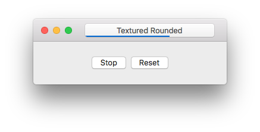

# BezelProgressButton [](https://raw.githubusercontent.com/notronik/PygmentsKit/master/LICENSE) [](https://github.com/Carthage/Carthage) [![Swift 3.0](https://img.shields.io/badge/Swift-3.0-EF5138.svg?style=flat-square&logo=data%3Aimage%2Fpng%3Bbase64%2CiVBORw0KGgoAAAANSUhEUgAAAA4AAAAOCAIAAACQKrqGAAAABGdBTUEAALGPC%2FxhBQAAAAlwSFlzAAALEwAACxMBAJqcGAAABCRpVFh0WE1MOmNvbS5hZG9iZS54bXAAAAAAADx4OnhtcG1ldGEgeG1sbnM6eD0iYWRvYmU6bnM6bWV0YS8iIHg6eG1wdGs9IlhNUCBDb3JlIDUuNC4wIj4KICAgPHJkZjpSREYgeG1sbnM6cmRmPSJodHRwOi8vd3d3LnczLm9yZy8xOTk5LzAyLzIyLXJkZi1zeW50YXgtbnMjIj4KICAgICAgPHJkZjpEZXNjcmlwdGlvbiByZGY6YWJvdXQ9IiIKICAgICAgICAgICAgeG1sbnM6dGlmZj0iaHR0cDovL25zLmFkb2JlLmNvbS90aWZmLzEuMC8iCiAgICAgICAgICAgIHhtbG5zOmV4aWY9Imh0dHA6Ly9ucy5hZG9iZS5jb20vZXhpZi8xLjAvIgogICAgICAgICAgICB4bWxuczpkYz0iaHR0cDovL3B1cmwub3JnL2RjL2VsZW1lbnRzLzEuMS8iCiAgICAgICAgICAgIHhtbG5zOnhtcD0iaHR0cDovL25zLmFkb2JlLmNvbS94YXAvMS4wLyI%2BCiAgICAgICAgIDx0aWZmOlJlc29sdXRpb25Vbml0PjI8L3RpZmY6UmVzb2x1dGlvblVuaXQ%2BCiAgICAgICAgIDx0aWZmOkNvbXByZXNzaW9uPjU8L3RpZmY6Q29tcHJlc3Npb24%2BCiAgICAgICAgIDx0aWZmOlhSZXNvbHV0aW9uPjcyPC90aWZmOlhSZXNvbHV0aW9uPgogICAgICAgICA8dGlmZjpPcmllbnRhdGlvbj4xPC90aWZmOk9yaWVudGF0aW9uPgogICAgICAgICA8dGlmZjpZUmVzb2x1dGlvbj43MjwvdGlmZjpZUmVzb2x1dGlvbj4KICAgICAgICAgPGV4aWY6UGl4ZWxYRGltZW5zaW9uPjE0PC9leGlmOlBpeGVsWERpbWVuc2lvbj4KICAgICAgICAgPGV4aWY6Q29sb3JTcGFjZT4xPC9leGlmOkNvbG9yU3BhY2U%2BCiAgICAgICAgIDxleGlmOlBpeGVsWURpbWVuc2lvbj4xNDwvZXhpZjpQaXhlbFlEaW1lbnNpb24%2BCiAgICAgICAgIDxkYzpzdWJqZWN0PgogICAgICAgICAgICA8cmRmOlNlcS8%2BCiAgICAgICAgIDwvZGM6c3ViamVjdD4KICAgICAgICAgPHhtcDpNb2RpZnlEYXRlPjIwMTY6MDk6MDMgMTc6MDk6ODc8L3htcDpNb2RpZnlEYXRlPgogICAgICAgICA8eG1wOkNyZWF0b3JUb29sPlBpeGVsbWF0b3IgMy41LjE8L3htcDpDcmVhdG9yVG9vbD4KICAgICAgPC9yZGY6RGVzY3JpcHRpb24%2BCiAgIDwvcmRmOlJERj4KPC94OnhtcG1ldGE%2BCu2pn9UAAAGNSURBVCgVjZHLK0VRFMb3Wnufx73yuF2PlAwor7gSBoqUKGVABgYyMDOQgTJTomQo%2F4KZlJGUsYGhEQMkIe9HouPee849e1nnXNerlD0457TWb33r%2B86G5%2BEO8b%2BDf2K%2B%2F6uVQ4mCRu4JpiXrmsRPOkSZsGywI1heIUjziHZeVUOLOTBCbvpTO6fq%2B6qxlVGjs4%2B1gcjb27VHJ1Rto8h4WTpEAYSXzhwfqLYulWi3x6dEJI%2FuroWU1uAYZV0JoT70UdLjnbu5Fp1ewMoqWdPkbq0LANnQjAVF9Obwd6iKGCQA8M9P3lbm9e2Vqk9EZxaBAximMK1sXAycmbbRM4CV1RzcPz1KLs%2Fpp%2FuPbSyhg6B8FIuR86IvTqOTs8KOUNLBWDEWxbNtiMXN7v7UxipvCL1K5R%2FuO0sz1tCY0dmL8VJepW8u3Z1terzH0nJQBk%2FC18VqTRkP8wuhpEyApIcb%2FfwUEPmFwnN5OPcHuIbIXimVpLMTwXcnkZcGNtIpNsnvb2hQZhEQ8mcx5LjzDnQqj2LsRLkOAAAAAElFTkSuQmCC)](https://swift.org)
A Cocoa component that provides a similar progress bar to Xcode or Safari inside the bezel of a textured rounded button.

## Requirements
- Xcode 8 or newer
- OS X 10.9 or newer (for the library)

## Screenshot


## Installation
### Carthage
Add the following line to your project's Cartfile:

```
github "notronik/BezelProgressButton" "master"
```

Run `carthage update` after adding and then reference the `BezelProgressButton.framework` in your own project.

### Manually
Open `BezelProgressButton.xcodeproj`, select the framework scheme if it's not selected already, build like normal. Once built, locate the framework and add it to your project.

Alternatively you could also just copy `BezelProgressButton.swift` into your project's source code. This isn't recommended, but if you want to keep down the number of frameworks that you're using, or you want to make modifications without forking, that's the only file that you will need.

## Usage
Instantiate a `BezelProgressButton` like you would create any other Cocoa component, be that using a Storyboard, Nib file, or in code. To change the progress value, set the `progress` property on `BezelProgressButton`. This will take care of updating the internal value, as well as displaying the new progress. It also animates like Safari's or Xcode's progress bars because that animation ships right with CoreAnimation. If you want to hide and/or reset the progress bar, do not set the `progress` value to `0.0`. Instead, call `resetProgress`. This sets `progress = 0.0`, but also hides the core animation layers. Setting `progress` to any other value or calling `updateProgress` will unhide the progress layers again.

You can also change the color of the progress bar by setting `progressColor`. If you want to revert to the default blue color, set this value to nil.

Both the `progress` and `progressColor` properties are marked `@IBInspectable`, so it should be easy to set default values from interface builder.

## License
MIT License. See [LICENSE](LICENSE).